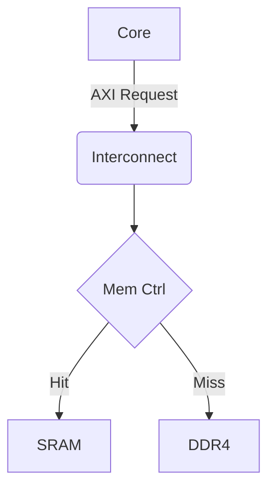
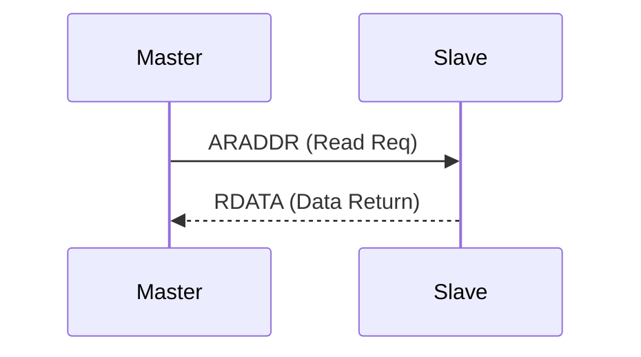
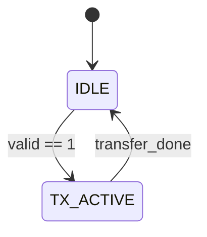

## [Ultimate Tech Blog Cheat Sheet: Markdown + HTML]

### 1. 텍스트 서식 및 구조 (Structure & Formatting)
| 기능 | 문법 (Syntax) | 렌더링 설명 및 목적 |
| :--- | :--- | :--- |
| **제목 (Header)** | `# 제목`<br>`## 소제목` | `<h1>`, `<h2>`. 목차(TOC) 생성 기준 |
| **텍스트 강조** | `**굵게**` / `*기울임*` / `~~취소선~~` | 텍스트 굵기 및 취소선 표시 |
| **인용 / 경고** | `> 인용문`<br>`>> 중첩 인용` | 팁(Tip)이나 경고 박스 생성 |
| **구분선 (Divider)**| `---` 또는 `***` | 문단 분리용 수평선 |
| **각주 (Footnote)** | `내용[^1]`<br>`[^1]: 설명` | 문서 하단 부연 설명 링크 매핑 |
| **글자 색상 (HTML)**| `<span style="color:red">에러</span>` | 강조 시그널 (순수 마크다운 미지원 보완) |
| **형광펜 (HTML)** | `<mark>형광펜</mark>` | 핵심 수치나 변수 배경 하이라이팅 |
| **줄바꿈 (br)** | `스페이스바 2번 + 엔터` | 마크다운 기본 문단의 강제 줄바꿈 |

### 2. 목록 및 표 (Lists & Tables)
| 기능 | 문법 (Syntax) | 렌더링 설명 및 목적 |
| :--- | :--- | :--- |
| **목록 (List)** | `- 항목 1`<br>`  - 하위 항목` | 무순서 나열 (Space 2번 들여쓰기로 계층화) |
| **숫자 목록** | `1. 첫째`<br>`2. 둘째` | 튜토리얼 등 순차적인 실행 단계 명시 |
| **체크리스트** | `- [ ] 할 일`<br>`- [x] 완료` | 개발 진행률 및 Todo 명시 |
| **표 (Table)** | `| A | B |`<br>`| :--- | ---: |`<br>`| 좌 | 우 |` | 정형화된 데이터 표시 (`:-` 좌, `-:` 우) |
| **표 내부 줄바꿈**| `첫 줄<br>두 번째 줄` | 표 내부 강제 줄바꿈 (반드시 HTML `<br>` 사용) |

### 3. 링크 및 미디어 (Links & Media)
| 기능 | 문법 (Syntax) | 렌더링 설명 및 목적 |
| :--- | :--- | :--- |
| **URL 링크** | `[텍스트](https://...)` | 외부 웹페이지 연결 |
| **문서 내 앵커** | `[목차로](#1-제목)` | 특정 제목(Heading)으로 스크롤 점프 |
| **기본 이미지** | `` | 원본 크기로 렌더링 |
| **정밀 이미지** | `` | 다이어그램/캡처본 해상도 조절 시 필수 |

### 4. 엔지니어링 렌더링 (Dev & HTML Hacks)
| 기능 | 문법 (Syntax) | 렌더링 설명 및 목적 |
| :--- | :--- | :--- |
| **인라인 코드** | \`clk_in\` | 문장 내부의 짧은 변수명 배경 처리 |
| **코드 블록** | \`\`\`verilog<br>module top();<br>\`\`\` | 구문 강조(Syntax Highlight)가 적용된 코드 박스 |
| **인라인 수식** | `$E=mc^2$` | 문장 내부에 삽입되는 LaTeX 수식 |
| **블록 수식** | `$$`<br>`F = ma`<br>`$$` | 중앙 정렬되는 독립 LaTeX 수식 블록 |
| **키보드 캡** | `<kbd>Ctrl</kbd>+<kbd>C</kbd>` | 단축키 설명을 실제 물리적 버튼 모양으로 렌더링 |

**🚨 긴 코드/로그 숨기기 (Toggle / Accordion)**
가독성을 해치는 수백 줄의 시뮬레이션 로그나 RTL 코드를 접어둡니다.
````markdown
<details>
<summary><b>여기를 클릭하여 전체 코드 확인</b></summary>
<div markdown="1">

```verilog
module dummy_interface();
    // 긴 코드나 로그를 여기에 삽입합니다.
endmodule
```

</div>
</details>
````

### 5. [Reference] 다이어그램 (Mermaid.js)
이미지 캡처 없이 코드로 아키텍처를 그립니다. 마크다운 코드 블록 언어에 `mermaid`를 선언하여 씁니다.

**A. 플로우차트 (Flowchart) - 아키텍처 설계**
````markdown

````

**B. 시퀀스 (Sequence) - 프로토콜 핸드쉐이크**
````markdown

````

**C. 상태 머신 (State) - FSM 제어 로직**
````markdown

````

---