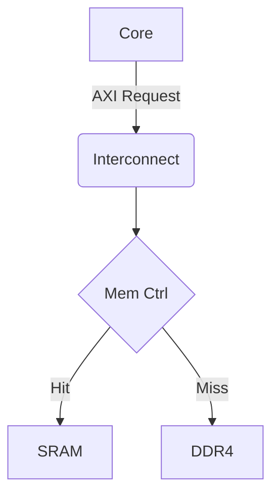
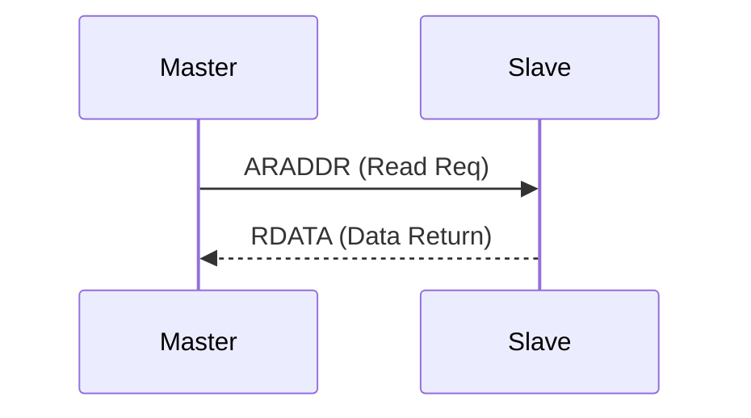
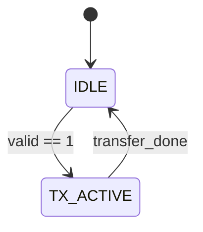

## [Ultimate Linux Master Cheat Sheet for Digital Design Eng.]

### 0. 접속 및 네트워크 통제 (Connection & Network)
홈 서버의 네트워크 상태를 확인하고 외부 PC와 통신하기 위한 최우선 명령어입니다.
| 명령어 | 실무 표준 구문 (Snippet) | 목적 및 원리 |
| :--- | :--- | :--- |
| **`ip`** | `ip a` | 내 서버의 로컬 IP 주소 및 MAC 주소 확인 (구 `ifconfig` 대체) |
| **`ping`** | `ping 8.8.8.8` | 외부 인터넷망이나 라우터로 패킷이 정상적으로 나가는지 회선 테스트 |
| **`ssh`** | `ssh -Y user@192.168.1.10` | 원격 서버 접속. `-Y` 옵션은 서버의 GUI 창(Verdi 등)을 내 PC 화면으로 포워딩 |
| **`scp`** | `scp -r ./rtl user@server:/home` | 로컬 PC와 서버 간에 소스 코드 폴더(`-r`)를 암호화하여 직접 복사 |
| **`ss`** | `ss -tuln` | 현재 서버에서 열려있는(Listen) 네트워크 포트 목록 및 통신 상태 확인 |

### 1. 파일 I/O 및 권한 제어 (I/O & Permission)
코드 작성 및 파일 통제의 뼈대입니다. 내 서버이므로 루트(`sudo`) 통제권을 포함합니다.
| 명령어 | 실무 표준 구문 (Snippet) | 목적 및 원리 |
| :--- | :--- | :--- |
| **`sudo`** | `sudo apt install tmux` | 최고 관리자(Root) 권한으로 패키지 설치 및 시스템 제어 |
| **`chown`** | `sudo chown -R $USER:$USER ./dir` | 폴더/파일의 소유권을 내 계정으로 귀속시켜 권한 거부 에러 해결 |
| **`chmod`** | `chmod 755 ./script.sh` | 쉘 스크립트나 실행 파일에 사용자/그룹/타인별 실행 및 읽기/쓰기 권한 부여 |
| **`echo`** | `echo "Run" > sim.log` | 터미널에 문자열 출력. `>`(덮어쓰기), `>>`(이어쓰기)로 텍스트 파일 즉시 생성 |
| **`cat`** | `cat ./sim.log` | 텍스트 파일의 전체 내용을 터미널 화면에 출력 (파이프라인의 시작점) |
| **`mkdir`** | `mkdir -p ./sim/logs/pass` | `-p`: 존재하지 않는 하위 폴더 경로 트리까지 한 번에 강제 생성 |
| **`rm`** | `rm -rf ./csrc` | `-rf`: 묻지 않고 하위 폴더와 내용물 강제 삭제 (경고: `/` 경로에서 절대 사용 금지) |
| **`cp` / `mv`** | `cp -r ./src ./backup` | `-r`: 폴더 전체 복사(`cp`). `mv`는 위치 이동 및 파일 이름 변경 |
| **`wget`** | `wget https://.../tool.tar.gz` | 웹에서 컴파일러, 스크립트 등 대용량 패키지를 서버 디스크로 직접 다운로드 |

### 2. 쉘 기초 및 생산성 해킹 (Ground Zero & Shortcuts)
터미널 작업 속도를 3배 이상 끌어올리는 홈-로우 제어기입니다.
| 단축키 / 명령어 | 실무 표준 구문 (Snippet) | 목적 및 원리 |
| :--- | :--- | :--- |
| **`pwd`** | `pwd` | 현재 내가 위치한 절대 경로 확인 (쉘 스크립트 디버깅 시 필수) |
| **`ls`** | `ls -alht` | **[필수]** 모든 파일(`a`)을 상세히(`l`), 용량은 읽기 쉽게(`h`), **최신 시간순(`t`) 정렬** |
| **`cd`** | `cd -` | **[꿀팁]** 바로 직전에 머물던 디렉토리로 즉시 귀환 (`cd ~`는 내 홈 디렉토리로) |
| **`history`** | `history \| grep vcs` | 과거에 타이핑했던 수만 줄의 명령어 기록 중 특정 키워드(컴파일 옵션 등) 색출 |
| **`Ctrl + r`** | (터미널에서 누름) | **[리버스 서치]** 과거 입력했던 명령어의 일부만 쳐서 자동완성 및 즉시 실행 |
| **`Ctrl + c`** / **`l`** | (터미널에서 누름) | 실행 중인 포어그라운드 프로그램 강제 중단(`c`) / 지저분한 로그 화면 초기화(`l`) |

### 3. 환경, 세션 및 프로세스 제어 (Env & Session)
| 명령어 | 실무 표준 구문 (Snippet) | 목적 및 원리 |
| :--- | :--- | :--- |
| **`tmux`** | `tmux new -s [이름]` / `tmux a -t [이름]`| 백그라운드 터미널 세션 생성 및 복구 (시뮬레이션 돌리고 퇴근할 때 필수) |
| **`export`** | `export LM_LICENSE_FILE=2700` | 라이센스, 경로(PATH) 등 환경 변수 주입 (`env` 명령어로 전체 변수 확인 가능) |
| **`source`** | `source ~/.bashrc` | 수정된 환경 설정 쉘 스크립트를 재부팅 없이 현재 터미널 메모리에 즉시 적재 |
| **`alias`** | `alias rsim='./run.sh'` | 빈번한 긴 명령어의 단축어 지정 (`~/.bashrc`에 등록해야 영구 보존) |
| **`which`** | `which vcs` | 시스템에 등록된 여러 버전의 툴 중, 현재 우선순위로 실행될 툴의 절대 경로 확인 |
| **`trap`** | `trap "pkill -P $$" EXIT` | 쉘 스크립트 실행 중 강제 종료(Ctrl+c) 시, 찌꺼기 자식 프로세스까지 깔끔하게 정리 |
| **`nohup`** | `nohup make run > log &` | Tmux 없이도 로그아웃 시 스크립트가 죽지 않고 백그라운드(`&`)에서 계속 돌게 만듦 |

### 4. 파일 시스템 탐색 및 동기화 (Find & Sync)
| 명령어 | 실무 표준 구문 (Snippet) | 목적 및 원리 |
| :--- | :--- | :--- |
| **`find`** | `find . -name "*.sv" -mtime -1` | 1일 이내(`-1`) 수정된 특정 확장자 파일 정밀 검색 및 색출 |
| **`ln`** | `ln -s /shared/tsmc16 ./pdk` | 대용량 디렉토리의 심볼릭 링크(가상 단축 아이콘) 생성 (경로 단순화) |
| **`readlink`** | `readlink -f ./pdk` | 심볼릭 링크 파일이 가리키는 실제 물리적 원본의 절대 경로 추적 |
| **`tar`** | `tar -czvf backup.tar.gz ./src` | 대용량 소스/데이터 아카이빙 및 압축 (`-xzvf`는 압축 해제) |
| **`rsync`** | `rsync -avzP ./src server:/dest` | 단절 시 이어받기(`-P`)가 가능한 **증분 동기화**(변경된 것만 골라 전송) 복사 |

### 5. 데이터 파싱 및 텍스트 외과 수술 (Text Analysis)
로그 파일의 바다에서 원하는 데이터만 정밀하게 도려내는 도구들입니다.
| 명령어 | 실무 표준 구문 (Snippet) | 목적 및 원리 |
| :--- | :--- | :--- |
| **`grep`** | `grep -rnw "ERROR" ./rtl` | 디렉토리 내 특정 문자열 매칭 라인 추출 (에러 및 넷 추적 1순위) |
| **`awk`** | `awk '/Slack/ {print $1, $3}' log` | 텍스트 스트림의 특정 열(Column) 데이터만 뜯어내서 정량적 리포트 생성 |
| **`sed`** | `sed -i 's/old/new/g' top.v` | 파일 열기 없이 스트림 상에서 특정 변수명, 매크로 등을 일괄 치환 |
| **`less`** | `less +F ./sim.log` | 수십 GB의 파일을 메모리 부하 없이 열고 `+F`로 실시간 변경 사항(Tail) 모니터링 |
| **`head`/`tail`** | `head -n 20 log` / `tail -f log` | 컴파일 옵션이 적힌 서두 20줄 확인 / 실시간으로 쏟아지는 로그 말미 감시 |
| **`wc`** | `grep "ERROR" log \| wc -l` | 파이프라인에서 넘어온 검색된 라인 수를 정량 카운트 (총 에러 개수 확인) |
| **`vimdiff`** | `vimdiff old.v new.v` | 2개의 소스 코드 변경점을 터미널 내에서 좌우 화면으로 시각적 대조 |
| **`diff3`** | `diff3 -m mine.v orig.v yours.v` | 3개 버전의 코드를 병합 및 충돌 지점(Conflict) 추출 |

### 6. 하드웨어 자원 및 프로세스 통제 (Resource & HW)
베어메탈 서버의 한계를 모니터링하고 컴퓨팅 자원을 할당합니다.
| 명령어 | 실무 표준 구문 (Snippet) | 목적 및 원리 |
| :--- | :--- | :--- |
| **`htop`** | `htop` | 다중 코어 CPU 점유율, 메모리 사용량, 스왑(Swap) 상태 실시간 모니터링 |
| **`free`** | `free -h` | **[필수]** 무거운 합성/시뮬레이션 전 시스템의 잔여 가용 RAM 용량 확인 |
| **`lsblk`** | `lsblk` | 서버에 장착된 물리적 하드디스크/SSD의 파티션 구조 및 마운트 경로 확인 |
| **`df` / `du`** | `du -sh ./* \| sort -rh` | 디스크 용량 100% 도달 시, 하위 폴더별 점유 용량을 랭킹순으로 정렬하여 색출 |
| **`ps`** | `ps -ef \| grep vcs` | 실행 중인 특정 툴의 프로세스 상태 및 ID(PID) 색출 |
| **`kill`** | `pkill -9 -f "vcs"` | 이름 패턴으로 무한 루프에 빠진 좀비 프로세스를 찾아 강제 사살 |
| **`lsof`** | `lsof ./simv.daidir` | 특정 DB 폴더나 파일을 락(Lock) 걸고 접근을 막고 있는 프로세스 추적 |
| **`nice`** | `renice -n 15 -p [PID]` | 장기 시뮬레이션의 커널 스케줄링 우선순위를 낮춰 다른 작업의 버벅임 방지 |

### 7. 파이프라인 자동화 및 로우레벨 진단 (Pipeline & Diag)
| 명령어 | 실무 표준 구문 (Snippet) | 목적 및 원리 |
| :--- | :--- | :--- |
| **`xargs`** | `find . -name "*.vcd" \| xargs rm -f` | 앞선 명령어의 다중 검색 결과 리스트를 뒤 명령어의 인자(Argument)로 일괄 전달 |
| **`tee`** | `./run 2>&1 \| tee run.log` | 표준 출력/에러를 터미널 화면에 띄워 실시간 확인하면서, 동시에 파일로 기록 분기 |
| **`date`** | `date +%Y%m%d_%H%M` | 스크립트 실행 시마다 절대 겹치지 않는 타임스탬프 고유 폴더/로그명 생성용 |
| **`dmesg`** | `dmesg -H \| grep error` | 서버 커널 버퍼 에러 확인 (OOM 메모리 부족 킬러 작동, PCIe 장치 오류 등) |
| **`strace`** | `strace -e open ./simv` | 원인 불명으로 툴이 멈췄을 때, 응답 대기 중인 리눅스 시스템 콜을 추적하여 디버깅 |
| **`lspci`** | `lspci -vvv -d 10ee:` | 보드/칩렛의 PCIe 링크 속도, 대역폭 및 BAR 메모리 할당 상태 등 물리적 통신 확인 |

---

## [Ultimate Vim Cheat Sheet for Digital Design Eng.]

### 1. 모드 전환 및 파일 제어 (Mode & File)
| 명령어 | 동작 원리 및 목적 |
| :--- | :--- |
| **`i` / `a`** | 커서 위치 앞(`i`) 또는 뒤(`a`)부터 Insert 모드 진입 |
| **`I` / `A`** | 현재 줄의 맨 앞(`I`) 또는 맨 뒤(`A`)로 이동하며 Insert 진입 |
| **`o` / `O`** | 현재 줄 아래(`o`) 또는 위(`O`)에 빈 줄을 삽입하며 Insert 진입 |
| **`ESC` / `Ctrl+[`** | 명령(Normal) 모드로 복귀 (손 동선 최소화를 위해 `Ctrl+[` 권장) |
| **`:w` / `:q`** | 파일 저장(`w`), 종료(`q`). 결합하여 `:wq` (저장 후 종료) |
| **`:q!`** | 파일 수정 사항 무시하고 강제 종료 (로그/원본 훼손 시 필수) |
| **`:e [파일]`** | 현재 창에서 새로운 파일 열기 |

### 2. 홈-로우 네비게이션 (Cursor Movement)
| 명령어 | 동작 원리 및 목적 |
| :--- | :--- |
| **`h`, `j`, `k`, `l`** | 좌, 하, 상, 우 이동 (방향키 사용 금지) |
| **`w` / `b`** | 단어(Word) 단위로 앞(`w`) 또는 뒤(`b`)로 점프 |
| **`e`** | 단어의 맨 끝 글자로 점프 |
| **`0` / `^` / `$`** | 줄의 맨 앞(`0`), 첫 번째 글자(`^`), 맨 뒤(`$`)로 점프 |
| **`gg` / `G`** | 파일의 첫 줄(`gg`) 또는 마지막 줄(`G`)로 점프 |
| **`150G` / `:150`** | 150번째 줄로 즉시 점프 (컴파일 에러 라인 추적용) |
| **`%`** | 짝이 맞는 괄호(`()`, `{}`, `[]`)로 점프 (모듈 begin-end 블록 파악) |

### 3. 텍스트 삭제 및 복사/수정 (Edit & Yank)
| 명령어 | 동작 원리 및 목적 |
| :--- | :--- |
| **`x` / `X`** | 커서 위치의 글자(`x`) 또는 앞 글자(`X`) 삭제 |
| **`dd` / `yy`** | 현재 줄 삭제/잘라내기(`dd`), 현재 줄 복사(`yy`) |
| **`5dd` / `5yy`** | 현재 줄 포함 아래로 5줄 지우기 / 복사하기 |
| **`p` / `P`** | 복사/삭제한 내용을 커서 아래(`p`) 또는 위(`P`)에 붙여넣기 |
| **`D` / `C`** | 커서부터 줄 끝까지 지우기(`D`) / 지우고 바로 Insert 진입(`C`) |
| **`J`** | 아랫줄을 끌어올려 현재 줄의 끝에 이어 붙임 (불필요한 줄바꿈 제거) |
| **`r` / `R`** | 커서 위치의 한 글자만 교체(`r`) / 계속해서 덮어쓰기(`R`) |

### 4. 정밀 수정 콤보 (Text Objects & Operators)
| 명령어 | 동작 원리 및 목적 |
| :--- | :--- |
| **`cw`** | 커서부터 단어 끝까지 지우고 Insert 진입 (변수명 수정) |
| **`ciw`** | 커서 위치와 무관하게 현재 단어 전체를 지우고 Insert 진입 |
| **`ci"` / `ci(`** | 따옴표 `""` 나 괄호 `()` 내부의 텍스트만 싹 지우고 Insert 진입 |
| **`u` / `Ctrl+r`** | 실행 취소 (Undo) / 다시 실행 (Redo) |
| **`.` (마침표)** | 직전에 수행한 텍스트 편집 동작을 현재 커서에서 그대로 반복 |

### 5. Visual 모드 및 세로 편집 (Visual & Block)
| 명령어 | 동작 원리 및 목적 |
| :--- | :--- |
| **`v` / `V`** | 글자 단위(`v`) 또는 줄 단위(`V`) 블록 지정 |
| **`Ctrl+v`** | **세로 블록 지정 (Visual Block)** - 포트 맵핑 등 구조적 편집 시 필수 |
| **`Shift+i` / `c`** | 블록 지정 후 일괄 삽입(`I`) 또는 일괄 교체(`c`) 후 `ESC` 2번 (주석 일괄 처리) |
| **`>>` / `<<`** | 지정된 블록(또는 현재 줄)의 들여쓰기(Indent) 증가/감소 |
| **`==`** | 꼬여버린 들여쓰기를 문법에 맞게 자동 정렬 (Auto-indent) |

### 6. 검색, 치환 및 레지스터 (Search & Replace)
| 명령어 | 동작 원리 및 목적 |
| :--- | :--- |
| **`/패턴` / `?패턴`** | 아래로 검색(`/`) / 위로 검색(`?`) |
| **`n` / `N`** | 검색 결과의 다음(`n`) 또는 이전(`N`) 방향으로 계속 탐색 |
| **`*` / `#`** | 현재 커서가 있는 단어와 똑같은 단어를 아래로(`*`) / 위로(`#`) 즉시 검색 |
| **`:%s/old/new/g`** | 파일 전체(`%`)에서 `old`를 찾아 `new`로 모두(`g`) 치환 |
| **`:%s/old/new/gc`** | 치환 시마다 변경할지 물어보게 설정(`c` : confirm) |
| **`"0p`** | 삭제(dd)로 인해 클립보드가 오염되어도, 순수하게 복사(yy)했던 내용만 붙여넣기 |

### 7. 화면 분할 및 다중 파일 제어 (Windows & Buffers)
| 명령어 | 동작 원리 및 목적 |
| :--- | :--- |
| **`:sp` / `:vsp`** | 창 가로 분할(`sp`) / 세로 분할(`vsp`) (RTL과 TB 파일 대조용) |
| **`Ctrl+w + h,j,k,l`** | 분할된 창 사이를 이동 |
| **`:bn` / `:bp`** | 열려 있는 버퍼(파일) 중 다음(`bn`) / 이전(`bp`) 파일로 전환 |

### 8. 시니어 레벨 팁: Ctags 및 마크/매크로 (Advanced)
| 명령어 | 동작 원리 및 목적 |
| :--- | :--- |
| **`Ctrl+]`** | (Ctags 사전 구성 필요) 현재 커서의 모듈/함수가 선언된 파일과 라인으로 즉시 점프 |
| **`Ctrl+t`** | `Ctrl+]`로 점프하기 이전의 원래 파일/위치로 되돌아옴 |
| **`ma` / `'a`** | 현재 위치를 `a`로 마킹(`ma`) / 파일 내 언제든 `'a`로 점프하여 복귀 |
| **`qa` -> 작업 -> `q`** | 키 스트로크 작업을 `a` 레지스터에 녹화 (단순 노가다 프로그래밍) |
| **`100@a`** | 녹화된 매크로 `a`를 100회 자동 반복 수행 |
| **`:g/Error/d`** | 파일 전체를 스캔하여 "Error"가 포함된 모든 줄을 삭제 (또는 `:v`로 반대 적용) |

---

## [Ultimate Tmux Cheat Sheet for Digital Design Eng.]
* 기본 Prefix Key: `Ctrl + a` 로 세팅 완료 가정 (`~/.tmux.conf` 적용)

### 1. 세션 제어 (Session Management) - 터미널 프롬프트에서
| 명령어 | 동작 원리 및 목적 |
| :--- | :--- |
| **`tmux new -s [이름]`** | 지정된 이름으로 새로운 독립 세션 생성 |
| **`tmux ls`** | 현재 백그라운드에 살아있는 세션 리스트 확인 |
| **`tmux a -t [이름]`** | 백그라운드의 특정 세션으로 재진입 (Attach) |
| **`tmux kill-session -t [이름]`** | 응답 없는 특정 세션 강제 완전 종료 |

### 2. 화면 분할 (Pane Management) - Tmux 내부에서
| 단축키 (`Ctrl+a` 누른 후) | 동작 원리 및 목적 |
| :--- | :--- |
| **`%`** (또는 셋팅한 `|`) | 현재 화면을 세로(좌/우)로 분할 |
| **`"`** (또는 셋팅한 `-`) | 현재 화면을 가로(상/하)로 분할 |
| **`방향키`** | 분할된 페인(창) 간 커서 이동 |
| **`Ctrl` + `방향키`** | 현재 페인의 크기(경계선) 늘리기/줄이기 |
| **`z`** | 현재 페인을 전체 화면으로 확대(Zoom) / 재입력 시 축소 |
| **`x`** | 현재 커서가 있는 페인만 강제 닫기 (kill) |
| **`:` -> `setw synchronize-panes`** | 현재 윈도우의 모든 페인에 키보드 입력 동시 전달 (On/Off) |

### 3. 윈도우 탭 제어 (Window Management)
| 단축키 (`Ctrl+a` 누른 후) | 동작 원리 및 목적 |
| :--- | :--- |
| **`c`** | 새로운 윈도우(탭) 생성 |
| **`n` / `p`** | 다음(Next) 윈도우 / 이전(Prev) 윈도우로 이동 |
| **`0~9` 숫자키** | 해당 번호가 부여된 윈도우로 즉시 이동 |
| **`w`** | 현재 세션의 전체 윈도우/페인 목록을 리스트로 보고 선택 이동 |

### 4. 백그라운드 전환 및 스크롤 (Detach & Scroll)
| 단축키 (`Ctrl+a` 누른 후) | 동작 원리 및 목적 |
| :--- | :--- |
| **`d` (Detach)** | **[핵심]** 현재 작업을 백그라운드에 살려둔 채 Tmux 밖으로 빠져나감 (퇴근 시 필수) |
| **`[` (Copy Mode)** | 스크롤 모드 진입. `PageUp/Down`이나 `j, k`로 과거 출력 로그 열람 가능 |
| *(스크롤 모드 중)* **`q`** | 스크롤 모드 종료 및 일반 프롬프트 복귀 |

---

## [Ultimate Tech Blog Cheat Sheet: Markdown + HTML]

### 1. 텍스트 서식 및 구조 (Structure & Formatting)
| 기능 | 문법 (Syntax) | 렌더링 설명 및 목적 |
| :--- | :--- | :--- |
| **제목 (Header)** | `# 제목`<br>`## 소제목` | `<h1>`, `<h2>`. 목차(TOC) 생성 기준 |
| **텍스트 강조** | `**굵게**` / `*기울임*` / `~~취소선~~` | 텍스트 굵기 및 취소선 표시 |
| **인용 / 경고** | `> 인용문`<br>`>> 중첩 인용` | 팁(Tip)이나 경고 박스 생성 |
| **구분선 (Divider)**| `---` 또는 `***` | 문단 분리용 수평선 |
| **각주 (Footnote)** | `내용[^1]`<br>`[^1]: 설명` | 문서 하단 부연 설명 링크 매핑 |
| **글자 색상 (HTML)**| `<span style="color:red">에러</span>` | 강조 시그널 (순수 마크다운 미지원 보완) |
| **형광펜 (HTML)** | `<mark>형광펜</mark>` | 핵심 수치나 변수 배경 하이라이팅 |
| **줄바꿈 (br)** | `스페이스바 2번 + 엔터` | 마크다운 기본 문단의 강제 줄바꿈 |

### 2. 목록 및 표 (Lists & Tables)
| 기능 | 문법 (Syntax) | 렌더링 설명 및 목적 |
| :--- | :--- | :--- |
| **목록 (List)** | `- 항목 1`<br>`  - 하위 항목` | 무순서 나열 (Space 2번 들여쓰기로 계층화) |
| **숫자 목록** | `1. 첫째`<br>`2. 둘째` | 튜토리얼 등 순차적인 실행 단계 명시 |
| **체크리스트** | `- [ ] 할 일`<br>`- [x] 완료` | 개발 진행률 및 Todo 명시 |
| **표 (Table)** | `| A | B |`<br>`| :--- | ---: |`<br>`| 좌 | 우 |` | 정형화된 데이터 표시 (`:-` 좌, `-:` 우) |
| **표 내부 줄바꿈**| `첫 줄<br>두 번째 줄` | 표 내부 강제 줄바꿈 (반드시 HTML `<br>` 사용) |

### 3. 링크 및 미디어 (Links & Media)
| 기능 | 문법 (Syntax) | 렌더링 설명 및 목적 |
| :--- | :--- | :--- |
| **URL 링크** | `[텍스트](https://...)` | 외부 웹페이지 연결 |
| **문서 내 앵커** | `[목차로](#1-제목)` | 특정 제목(Heading)으로 스크롤 점프 |
| **기본 이미지** | `` | 원본 크기로 렌더링 |
| **정밀 이미지** | `` | 다이어그램/캡처본 해상도 조절 시 필수 |

### 4. 엔지니어링 렌더링 (Dev & HTML Hacks)
| 기능 | 문법 (Syntax) | 렌더링 설명 및 목적 |
| :--- | :--- | :--- |
| **인라인 코드** | \`clk_in\` | 문장 내부의 짧은 변수명 배경 처리 |
| **코드 블록** | \`\`\`verilog<br>module top();<br>\`\`\` | 구문 강조(Syntax Highlight)가 적용된 코드 박스 |
| **인라인 수식** | `$E=mc^2$` | 문장 내부에 삽입되는 LaTeX 수식 |
| **블록 수식** | `$$`<br>`F = ma`<br>`$$` | 중앙 정렬되는 독립 LaTeX 수식 블록 |
| **키보드 캡** | `<kbd>Ctrl</kbd>+<kbd>C</kbd>` | 단축키 설명을 실제 물리적 버튼 모양으로 렌더링 |

**🚨 긴 코드/로그 숨기기 (Toggle / Accordion)**
가독성을 해치는 수백 줄의 시뮬레이션 로그나 RTL 코드를 접어둡니다.
````markdown
<details>
<summary><b>여기를 클릭하여 전체 코드 확인</b></summary>
<div markdown="1">

```verilog
module dummy_interface();
    // 긴 코드나 로그를 여기에 삽입합니다.
endmodule
```

</div>
</details>
````

### 5. [Reference] 다이어그램 (Mermaid.js)
이미지 캡처 없이 코드로 아키텍처를 그립니다. 마크다운 코드 블록 언어에 `mermaid`를 선언하여 씁니다.

**A. 플로우차트 (Flowchart) - 아키텍처 설계**
````markdown

````

**B. 시퀀스 (Sequence) - 프로토콜 핸드쉐이크**
````markdown

````

**C. 상태 머신 (State) - FSM 제어 로직**
````markdown

````

---

## [Ultimate Git Cheat Sheet for Digital Design Eng.]

### 0. 프로젝트 초기화 및 방역 (Genesis & Ignore)
| 명령어 / 개념 | 실무 동작 원리 및 목적 |
| :--- | :--- |
| **`git init`** | 현재 폴더를 Git DB(`.git`)로 초기화 |
| **`git clone [URL]`** | 기존에 존재하는 원격 저장소를 내 로컬로 완벽히 복제하여 가져옴 |
| **`.gitignore` (파일)** | `*.fsdb`, `simv`, `*.log` 등 용량을 파괴하는 EDA 툴 쓰레기 파일들을 Git이 아예 무시하도록 명시하는 텍스트 파일 (프로젝트 시작 시 1순위 작성) |
| **`git remote add origin [URL]`**| 로컬 DB와 원격(GitHub/GitLab) 서버 URL 매핑 |

### 1. 일일 작업 파이프라인 (Daily Loop)
| 명령어 | 실무 동작 원리 및 목적 |
| :--- | :--- |
| **`git status`** | [호흡하듯 입력] 수정된 파일들이 어느 구역(Working / Staging)에 있는지 확인 |
| **`git add [파일]`** | 수정한 파일을 Staging Area(커밋 대기열)로 올림 |
| **`git restore --staged [파일]`**| 앗, 잘못 올렸다. **`add`한 파일을 다시 대기열에서 내림 (내용은 유지)** |
| **`git commit -m "msg"`** | 대기열의 파일들을 하나의 스냅샷으로 영구 기록 |
| **`git commit --amend`** | **[핵심]** 방금 한 커밋의 메시지를 수정하거나, 빼먹은 파일을 슬쩍 껴넣어 기존 커밋을 덮어씀 (지저분한 커밋 내역 방지) |

### 2. 브랜치와 원격 동기화 (Branch & Sync)
| 명령어 | 실무 동작 원리 및 목적 |
| :--- | :--- |
| **`git fetch`** | 원격 저장소의 최신 업데이트 내역만 **'조회'**하여 로컬에 가져옴 (내 코드는 안전함) |
| **`git pull`** | 원격 저장소의 최신 코드를 가져와서 **내 현재 코드와 강제로 병합(Merge)함** |
| **`git push -u origin main`** | 로컬 브랜치를 원격에 올리고 **영구 추적(-u)**. 이후엔 `git push`만 쳐도 됨 |
| **`git switch [브랜치]`** | 대상 브랜치 작업 환경으로 이동 |
| **`git switch -c [브랜치]`** | 새 브랜치를 생성함과 동시에 이동 |
| **`git branch -d [브랜치]`** | 병합(Merge)이 완료된 안전한 브랜치 삭제 |
| **`git branch -D [브랜치]`** | 병합되지 않은 망친 브랜치 **강제 삭제** |

### 3. 임시 대피소 (Stash) - 컨텍스트 스위칭
| 명령어 | 실무 동작 원리 및 목적 |
| :--- | :--- |
| **`git stash`** | 현재 작업 중이던(커밋하기엔 애매한) 지저분한 코드를 서랍에 숨기고 상태를 깨끗하게 비움 (급하게 다른 브랜치로 넘어가야 할 때 필수) |
| **`git stash list`** | 현재 서랍(Stash)에 넣어둔 임시 작업물들의 목록 확인 |
| **`git stash pop`** | 다른 일을 마치고 돌아와서, 서랍에 넣어둔 코드를 다시 꺼내와서 이어붙임 |
| **`git stash drop`** | 더 이상 필요 없는 서랍 속 임시 코드 폐기 |

### 4. 디버깅 및 외과 수술 (Inspection & Tracking)
`HEAD` = 현재 내가 머물고 있는 커밋 / `HEAD~1` = 직전(부모) 커밋

| 명령어 | 실무 동작 원리 및 목적 |
| :--- | :--- |
| **`git log --oneline --graph`** | 전 브랜치의 커밋 트리를 지하철 노선도 형태로 시각화 |
| **`git log --stat -1`** | 가장 최근 커밋(`-1`)에서 파일 단위로 **몇 줄이 추가/삭제되었는지 통계 요약** |
| **`git show [Hash]`** | 특정 커밋에서 정확히 어떤 코드가 변경(+/-)되었는지 상세 확인 |
| **`git diff`** | 내가 현재 치고 있는 코드(미추적)와 직전 커밋 간의 차이 비교 |
| **`git diff --staged`** | `add`된 파일과 직전 커밋 간 차이 비교 (커밋 직전 최종 리뷰용) |
| **`git diff HEAD`** | **[전체 요약]** 현재 `add` 된 것과 안 된 것을 모두 합쳐서, 마지막 커밋 대비 변경점 전체 출력 |
| **`git blame [파일]`** | **[범인 찾기]** 파일의 라인별로 이 코드를 '누가, 언제, 어느 커밋에서' 짰는지 추적 |
| **`git cherry-pick [Hash]`** | 다른 브랜치의 수많은 커밋 중, 딱 **내가 원하는 커밋 하나만** 내 브랜치로 복사 |
| **`git bisect`** | **[이진 탐색 디버깅]** 시뮬레이션이 깨졌을 때, 정상이었던 커밋과 현재 커밋 사이를 반씩 쪼개어가며 **버그를 유발한 최초의 커밋을 자동 탐색** (시작: `bisect start`, 에러: `bad`, 정상: `good`, 종료: `reset`) |

### 5. 시공간 조작 및 복구 (Time Travel & Rescue) - ⚠️ 위험
| 명령어 | 실무 동작 원리 및 목적 |
| :--- | :--- |
| **`git restore [파일]`** | 작업 중이던 파일을 마지막 커밋 상태로 **초기화 (수정 내용 다 날아감)** |
| **`git merge --abort`** | **[탈출구]** 브랜치 병합 중 충돌(Conflict)이 너무 심해 감당 안 될 때, **병합을 즉시 취소하고 원래 상태로 롤백** |
| **`git revert [Hash]`** | 과거를 지우지 않고, 지정한 커밋의 변경 사항을 정반대로 뒤집는 **새로운 커밋을 추가**. (이미 Push된 코드를 롤백할 때 팀원의 DB 붕괴를 막는 유일한 합법적 방법) |
| **`git reset --soft [Hash]`** | **[안전]** 시간을 되돌림. 파일 수정 내용과 `add` 상태는 모두 그대로 유지됨 |
| **`git reset --mixed [Hash]`**| **[기본]** 시간을 되돌림. 파일 수정 내용은 유지되나, `add`는 취소됨 |
| **`git reset --hard [Hash]`** | **[파괴]** 시간을 되돌리고, 그 시점 이후의 **모든 로컬 수정 내역을 디스크에서 영구 삭제** |
| **`git reflog`** | **[최후의 보루]** 내가 로컬에서 수행한 모든 행동(커밋, 브랜치 이동, 심지어 `reset --hard`로 지워버린 내역까지)의 기록. 여기서 해시값을 찾아 다시 `reset --hard [찾은Hash]`를 치면 날아간 코드도 복구 가능 |

---

## [Appendix A: High-Speed Data Control Cheat Sheet]

### 1. rsync (Remote Synchronization)
단순 복사(`cp`, `scp`)를 압도하는 최고의 동기화 툴입니다. 전송 중 인터넷이 끊기면 처음부터 다시 보내야 하는 `scp`와 달리, `rsync`는 변경된 블록만 전송(증분 동기화)하고 이어받기가 가능합니다.

**💡 실무 표준 콤보**
```bash
# 로컬의 sim_dir 전체를 서버의 /backup 폴더로 전송 (이어받기 + 압축 + 진행률 표시)
rsync -avzP ./sim_dir/ user@192.168.1.10:/backup/sim_dir/

# 특정 확장자(예: fsdb)만 빼고 전송 (용량 절약)
rsync -avzP --exclude="*.fsdb" ./sim_dir/ user@server:/backup/
```

**🛠️ 핵심 옵션 해부**
* `-a` (--archive): 파일의 권한(Permission), 소유자, 타임스탬프, 심볼릭 링크를 원본 그대로 유지하며 복사합니다.
* `-v` (--verbose): 전송 진행 상황을 터미널에 상세히 출력합니다.
* `-z` (--compress): 네트워크 전송 시 데이터를 압축하여 대역폭 소모를 줄입니다. 텍스트로 된 시뮬레이션 로그 전송 시 속도가 수 배 빨라집니다.
* `-P` (--partial --progress): **[가장 중요]** 전송 중 끊겨도 찌꺼기 파일을 남겨두어 훗날 **이어받기(Resume)**를 수행합니다.
* `--delete`: 원격 저장소에만 있고 로컬(원본)에는 없는 파일을 자동으로 삭제하여 두 폴더를 완벽한 거울(Mirroring) 상태로 만듭니다. (주의해서 사용)

### 2. pigz (Parallel Implementation of GZip)
일반적인 `tar.gz` 압축은 서버의 CPU 코어를 딱 1개만 씁니다. `pigz`는 **서버의 모든 다중 코어를 100% 갈아 넣어** 수십 GB의 데이터를 순식간에 압축하고 해제합니다.

**💡 실무 표준 콤보**
```bash
# 1. 아카이빙(tar)과 동시에 pigz로 병렬 압축하기
tar -I pigz -cvf backup_sim.tar.gz ./sim_dir

# 2. 압축 풀기
tar -I pigz -xvf backup_sim.tar.gz

# 3. 옵션 제어 (모든 코어를 다 쓰면 서버가 터지므로 코어 개수 제한)
tar -I 'pigz -p 8' -cvf backup.tar.gz ./src  # CPU 코어 8개만 할당
```

---

## [Appendix B: Build Automation & Remote GUI Cheat Sheet]

### 1. Makefile (디지털 설계 빌드 자동화의 알파와 오메가)
Verilog/SystemVerilog 파일이 수백 개로 늘어나면 쉘 스크립트(`.sh`)로는 의존성 관리가 불가능합니다. `make`는 타겟과 의존성을 비교하여 **"수정된 파일만"** 스마트하게 재컴파일합니다.

**💡 디지털 설계(VCS 기준) 실무 Makefile 템플릿**
폴더에 `Makefile` (M 대문자)이라는 이름으로 저장 후 사용합니다.
```makefile
# --- [변수 선언부] ---
COMPILER = vcs
CFLAGS = -full64 -sverilog -debug_access+all -timescale=1ns/1ps
RTL_SRC = top.sv router.sv
TB_SRC = router_tb.sv

# --- [규칙(Rule) 선언부] ---
# 구문: 
# 타겟(Target): 의존성(Dependencies)
#     명령어(Command) -> **반드시 Tab 키로 들여쓰기 할 것 (Space 금지)**

# 기본 타겟 (make만 치면 실행됨)
all: compile run

# 1. 컴파일: 소스 코드가 변경되었을 때만 실행됨
simv: $(RTL_SRC) $(TB_SRC)
    $(COMPILER) $(CFLAGS) $(RTL_SRC) $(TB_SRC) -o simv

# 강제 매핑 타겟 (이름만 지정)
compile: simv

# 2. 시뮬레이션 실행
run: simv
    ./simv -l run.log

# 3. 찌꺼기 청소 (가짜 타겟 선언 - 실제 파일명과 겹침 방지)
.PHONY: clean
clean:
    rm -rf csrc simv simv.daidir *.vcd *.fsdb *.log ucli.key
```

### 2. SSH (Secure Shell) & X11 포워딩
단순히 터미널 텍스트 창만 띄우는 것이 아니라, 원격 서버와 내 PC 사이를 완벽하게 연결하는 통로입니다.

**💡 실무 표준 콤보**
```bash
# 1. X11 포워딩 접속 (서버의 GUI 창을 내 PC로 끌어오기)
ssh -Y user@192.168.1.10
# 접속 후 터미널에 `verdi &`를 치면 내 모니터에 Verdi 창이 뜹니다.

# 2. 비밀번호 없이 자동 로그인 설정 (SSH Key-pair)
# (내 PC에서 실행)
ssh-keygen -t ed25519 -C "my_laptop"  # 엔터만 3번 쳐서 키 생성
ssh-copy-id user@192.168.1.10         # 생성된 공개키를 서버로 복사 (이때만 비번 입력)
# 이후부터는 ssh user@192.168.1.10 쳐도 비번을 묻지 않습니다.
```
* **Tip:** `-X` 옵션도 X11 포워딩이지만, 보안 제약 때문에 EDA 툴(Verdi 등)의 무거운 렌더링이 깨지는 경우가 잦습니다. 실무에서는 신뢰할 수 있는 서버(`-Y`) 옵션을 주로 사용합니다.

---

## [Appendix C: SysAdmin (Firewall & Scheduler) Cheat Sheet]

### 1. UFW (Uncomplicated Firewall)
리눅스 서버를 인터넷에 연결하는 순간 전 세계에서 해킹 봇(Bot)들이 포트 스캐닝을 시도합니다. 내가 접속할 포트만 열어두고 나머지는 콘크리트로 막아버려야 합니다.

**💡 실무 표준 콤보 (Root 권한 필요)**
```bash
# 1. 방화벽 상태 확인 (초기엔 inactive)
sudo ufw status

# 2. 기본 정책 설정 (들어오는 건 다 막고, 나가는 건 다 허용)
sudo ufw default deny incoming
sudo ufw default allow outgoing

# 3. SSH 접속 포트(22번) 허용 (이거 안 열고 방화벽 켜면 영원히 접속 불가됨)
sudo ufw allow 22/tcp

# 4. 방화벽 가동
sudo ufw enable

# 5. 적용된 룰 확인
sudo ufw status numbered

# 6. 잘못 만든 룰 삭제 (5번에서 확인한 번호 입력)
sudo ufw delete [번호]
```

### 2. Crontab (Cron Table)
새벽 3시마다 용량을 차지하는 오래된 `.fsdb` 덤프 파일을 지우거나, 백업 스크립트를 주기적으로 돌리게 만드는 백그라운드 스케줄러입니다.

**💡 기본 문법 및 설정**
```bash
# 스케줄 편집기 열기 (처음 실행 시 nano나 vim 선택)
crontab -e

# 스케줄 등록 목록 확인
crontab -l
```

**⏰ 크론탭 시간 설정 공식**
```text
* * * * * 실행할_명령어_또는_스크립트_절대경로
┬ ┬ ┬ ┬ ┬
│ │ │ │ └─ 요일 (0=일, 1=월, ..., 6=토)
│ │ │ └─── 월 (1~12)
│ │ └───── 일 (1~31)
│ └─────── 시 (0~23)
└───────── 분 (0~59)
```

**💡 실무 등록 예시 (crontab -e 창 내부에 작성)**
```bash
# 매일 새벽 4시 0분에 /backup 폴더로 rsync 동기화 실행
0 4 * * * rsync -avz --delete /home/user/sim/ /backup/sim/

# 매주 일요일(0) 밤 11시 30분에 오래된 로그 청소 스크립트 실행
30 23 * * 0 /home/user/scripts/auto_clean.sh

# 10분마다 특정 서버 상태 체크 스크립트 실행
*/10 * * * * /home/user/scripts/health_check.sh >/dev/null 2>&1
```
* **Tip:** Cron은 터미널 환경변수(PATH)를 공유하지 않으므로, 실행할 스크립트나 파일 경로는 무조건 **절대 경로(`/home/user/...`)**로 적는 것이 철칙입니다.